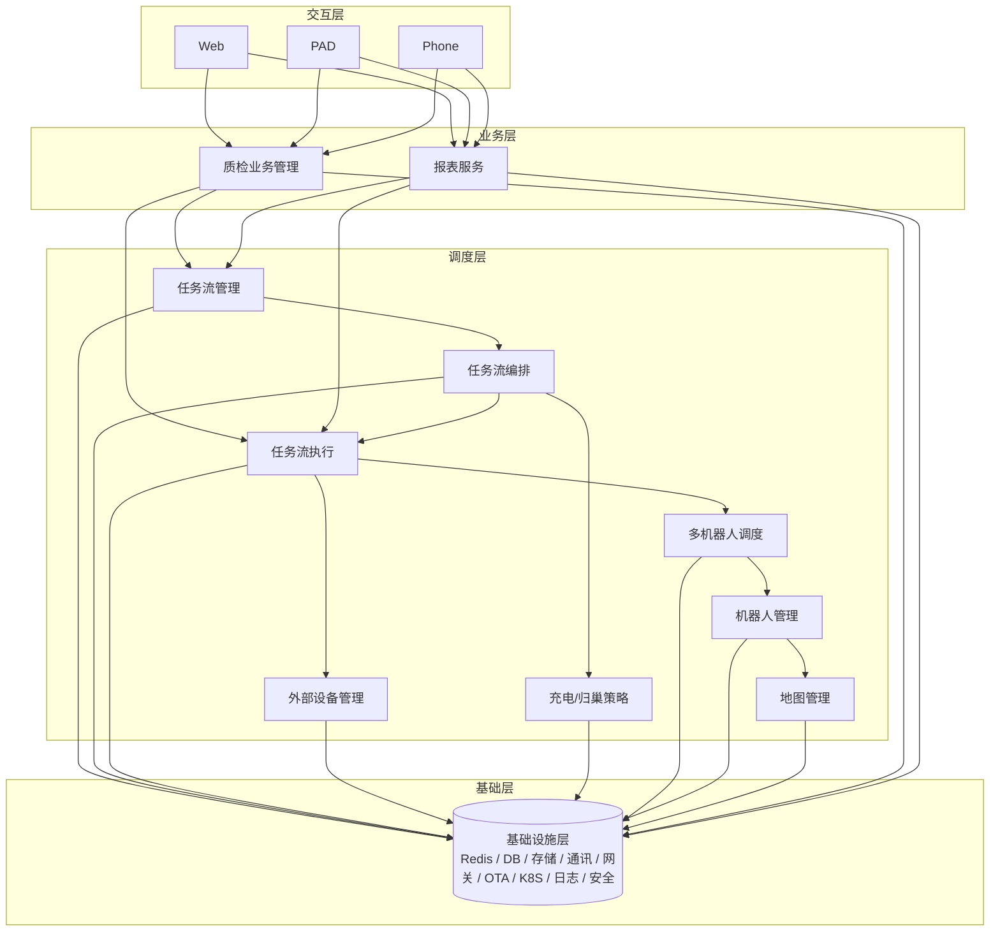

# 后端模块与包结构说明

按**方式 B（细分）**划分，共约 14 个业务模块，便于多人并行与按域迭代。未开发模块已预留包与 URL 前缀，后续开发时在对应包下新增 Controller/Service 即可。

---

## 一、模块与 URL 前缀

| 模块 | 职责概要 | URL 前缀 | 包路径（Controller） | 当前状态 |
|------|-----------|----------|----------------------|----------|
| **auth** | 登录、登出、当前用户、Token | `/api/auth` | `controller.auth` | ✅ 已实现 |
| **deploy-user** | 用户、角色、权限（菜单） | `/api/deploy/users`、`/api/deploy/roles`、`/api/deploy/menus` | `controller.deploy.user` | ✅ 已实现 |
| **deploy-config** | 任务模板、动作模板、配置模板、地图、设备 | `/api/deploy`（除 users/roles/robot-* 外） | `controller.deploy.config` | 📁 已建包，待开发 |
| **deploy-robot** | 机器人类型/分组/零部件、充电策略、归巢策略 | `/api/deploy/robots`、`/api/deploy/robot-*`、charge-strategies、homing-strategies | `controller.deploy.robot` | ✅ 已实现（机器人 CRUD） |
| **qc-business** | 工作站、工位、工单、复检记录 | `/api/qc/workstations`、work-orders、reinspection-records 等 | `controller.qc.business` | 📁 已建包，待开发 |
| **qc-config** | 工作站配置、工位配置、线束类型、终端、车间 | `/api/qc/config/*` | `controller.qc.config` | 📁 已建包，待开发 |
| **qc-statistics** | 质检统计、质检报表 | `/api/qc/statistics` 或 `/api/statistics/quality` | `controller.qc.statistics` | 📁 已建包，待开发 |
| **operation-task** | 任务列表、暂停/恢复/取消 | `/api/operation/tasks` | `controller.operation.task` | 📁 已建包，待开发 |
| **operation-robot** | 机器人列表与状态、机器人控制指令 | `/api/operation/robots`、`/api/v1/robot/*` | `controller.operation.robot` | 📁 已建包，待开发 |
| **ops-notification** | 异常通知、登录/操作/API 日志 | `/api/ops/exception-notifications`、`/api/ops/logs/*` | `controller.ops.notification` | 📁 已建包，待开发 |
| **operation-file** | 文件上传、列表、删除 | `/api/operation/files` | `controller.operation.file` | 📁 已建包，待开发 |
| **operation-upgrade** | 软件包、发布任务、升级设备目录 | `/api/operation/packages`、publish | `controller.operation.upgrade` | 📁 已建包，待开发 |
| **operation-service** | 服务列表与状态 | `/api/operation/services` | `controller.operation.service` | 📁 已建包，待开发 |
| **statistics** | 设备统计、异常统计 | `/api/statistics/devices`、exceptions | `controller.statistics` | 📁 已建包，待开发 |

根路径下另有：

- **健康/根路径**：`/api`（HealthController、RootController 等）— 位于 `controller` 根包。

---

## 二、Java 包结构示例

```
com.zioneer.robotqcsystem
├── controller
│   ├── auth                    # auth 模块
│   │   ├── AuthController.java
│   │   └── DevController.java
│   ├── deploy
│   │   ├── user                # deploy-user 模块
│   │   │   ├── UserController.java
│   │   │   ├── RoleController.java
│   │   │   └── MenuController.java
│   │   ├── config              # deploy-config 模块（待开发）
│   │   └── robot               # deploy-robot 模块
│   │       └── RobotController.java
│   ├── qc
│   │   ├── business            # qc-business（待开发）
│   │   ├── config              # qc-config（待开发）
│   │   └── statistics          # qc-statistics（待开发）
│   ├── operation
│   │   ├── task                # operation-task（待开发）
│   │   ├── robot               # operation-robot（待开发）
│   │   ├── notification        # ops-notification（待开发）
│   │   ├── file                # operation-file（待开发）
│   │   ├── upgrade             # operation-upgrade（待开发）
│   │   └── service             # operation-service（待开发）
│   ├── statistics              # statistics（待开发）
│   ├── HealthController.java
│   └── RootController.java
├── service
├── mapper
├── domain
│   ├── dto
│   ├── vo
│   └── entity
├── common
│   ├── result
│   ├── exception
│   ├── page
│   └── constant
└── config
```

每个模块包下均有 `package-info.java`，注明职责与 URL 前缀，便于新人定位。

---

## 三、模块与前端菜单对应（预留）

| 前端菜单（示例） | 后端模块 |
|------------------|----------|
| 登录 / 个人中心 | auth |
| 部署配置 → 用户 / 角色 / 菜单 | deploy-user |
| 部署配置 → 任务模板 / 地图 / 设备 等 | deploy-config |
| 部署配置 → 机器人类型 / 充电策略 / 归巢策略 | deploy-robot |
| 质检 → 工作站 / 工单 / 复检记录 | qc-business |
| 质检 → 配置（线束类型、终端、车间） | qc-config |
| 质检 → 统计 / 报表 | qc-statistics |
| 运营 → 任务列表 | operation-task |
| 运营 → 机器人列表与控制 | operation-robot |
| 运营 → 异常通知 / 日志 | ops-notification |
| 运营 → 文件 | operation-file |
| 运营 → 升级 | operation-upgrade |
| 运营 → 服务 | operation-service |
| 统计 → 设备 / 异常 | statistics |

具体菜单 key 与路由以后端/前端约定为准，可在联调时补全。

---

## 四、公共能力归属建议

| 能力 | 建议位置 | 说明 |
|------|----------|------|
| **认证** | auth 模块 + `config.SecurityConfig` | 登录、Token、登出在 auth；过滤器与安全配置在 config |
| **权限** | deploy-user（菜单/角色权限） + 全局拦截 | 权限数据与配置在 deploy-user；鉴权逻辑在 Filter/Interceptor |
| **操作日志** | common 或 ops-notification | 可落库或写日志中心，由 ops-notification 或公共切面统一记录 |
| **API 日志** | common（Filter/Interceptor） | 请求/响应日志建议在公共层，不占业务包 |
| **文件存储** | operation-file 或 common | 上传/下载接口在 operation-file；存储抽象可放 common |
| **统一响应** | common.result | 已存在 `Result<T>`、`PageResult<T>` |
| **统一异常** | common.exception | 已存在 `GlobalExceptionHandler`、`BusinessException` |

---

## 五、开发约定

1. **新增接口**：先确定所属模块，在对应 `controller.xxx` 包下新建或扩展 Controller，URL 使用上表前缀。
2. **未开发模块**：仅保留包与 `package-info.java`，无 Controller 时可空包；开发时在该包下新增类即可。
3. **跨模块调用**：通过 Service 层调用，避免 Controller 跨包直接依赖；公共能力用 common 或独立模块暴露。

文档位置：`docs/模块与包结构.md`。接口明细见 `docs/API接口文档.md`。

---

## 六、详细设计模块图（参考版）

以下模块图按你提供的参考图做了工程化映射，可直接用于详细设计文档。

### 6.1 分层与模块划分图



### 6.2 模块调用/依赖关系图（后端实现视角）

```mermaid
flowchart LR
    CLIENT[Web/PAD/Phone]
    GATEWAY[网关/API入口]
    AUTH[认证鉴权 auth]

    QCB[质检业务模块\nqc-business]
    QCC[质检配置模块\nqc-config]
    QCS[质检统计/报表\nqc-statistics]

    OPRT[任务流管理\noperation-task]
    OPRB[机器人管理与控制\noperation-robot]
    OPRU[升级发布\noperation-upgrade]
    OPRF[文件管理\noperation-file]
    OPRN[通知与日志\nops-notification]

    DPR[部署-机器人策略\n(deploy-robot: 充电/归巢)]
    DPC[部署-配置\n(deploy-config: 地图/模板/设备)]

    DB[(PostgreSQL)]
    REDIS[(Redis)]
    MQ[(事件总线/消息)]
    STORE[(对象存储/文件)]
    OTA[(OTA通道)]

    CLIENT --> GATEWAY --> AUTH
    GATEWAY --> QCB
    GATEWAY --> QCC
    GATEWAY --> QCS
    GATEWAY --> OPRT
    GATEWAY --> OPRB
    GATEWAY --> OPRU
    GATEWAY --> OPRF
    GATEWAY --> OPRN
    GATEWAY --> DPR
    GATEWAY --> DPC

    QCB --> OPRT
    OPRT --> OPRB
    OPRT --> DPR
    OPRB --> DPC
    QCS --> QCB
    QCS --> OPRT
    OPRU --> OPRB
    OPRU --> OPRF

    QCB --> DB
    QCC --> DB
    QCS --> DB
    OPRT --> DB
    OPRB --> DB
    OPRU --> DB
    OPRF --> STORE
    DPR --> DB
    DPC --> DB

    QCB --> REDIS
    OPRT --> REDIS
    OPRB --> REDIS
    OPRN --> MQ
    OPRU --> OTA
```

### 6.3 设计约束（建议在详细设计里一并说明）

1. **上层只调用下层**：交互层不直连调度层；业务层通过 `任务流管理` 聚合调用。
2. **编排与执行分离**：`任务流编排` 只产生命令/计划，`任务流执行` 负责状态机与执行闭环。
3. **策略中心化**：充电/归巢策略统一由 `deploy-robot` 管理，执行层只消费策略快照。
4. **统计只读**：报表服务仅消费业务与执行数据，不反向写核心业务表。
5. **基础能力下沉**：存储、缓存、日志、安全、OTA 等统一归基础设施层，业务模块通过抽象接口接入。
